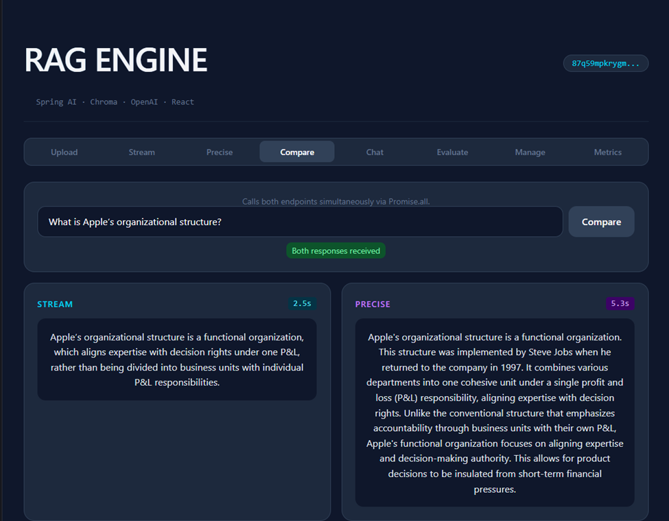
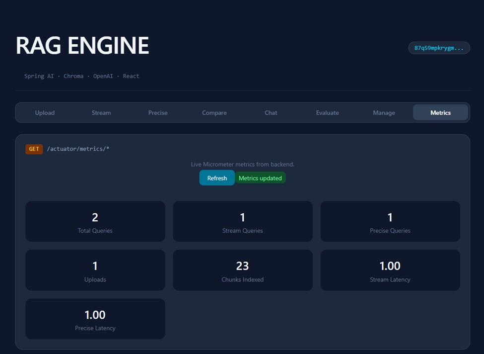

# spring-ai-rag-pipeline

A full-stack Retrieval-Augmented Generation (RAG) application built with **Spring AI**, **Chroma**, **OpenAI**, and **React**. Upload PDF documents, ask questions, and get grounded answers — with three query modes, side-by-side comparison, groundedness evaluation, and live metrics.

```
spring-ai-rag-pipeline/
├── backend/          # Spring Boot 3 + Spring AI
├── frontend/         # React 18 + Vite
├── docker-compose.yml
└── README.md
```

---

## Architecture

```
┌─────────────────────────────────────────────────────────┐
│                      React Frontend                      │
│  Upload │ Stream │ Precise │ Chat │ Compare │ Evaluate  │
│                    Manage │ Metrics                      │
└───────────────────────┬─────────────────────────────────┘
                        │ HTTP / SSE
┌───────────────────────▼─────────────────────────────────┐
│               Spring Boot Backend (:8080)                │
│                                                          │
│  ┌──────────────────┐        ┌────────────────────────┐ │
│  │ UploadController │        │     RagController      │ │
│  └────────┬─────────┘        └───────────┬────────────┘ │
│           │                              │               │
│  ┌────────▼─────────┐        ┌───────────▼────────────┐ │
│  │   PdfService     │        │       RagService       │ │
│  │   IndexService   │        │  (stream/precise/chat) │ │
│  └────────┬─────────┘        └───────────┬────────────┘ │
└───────────┼──────────────────────────────┼──────────────┘
            │                              │
            ▼                              ▼
     ┌─────────────┐             ┌──────────────────┐
     │  Chroma DB  │             │   OpenAI API     │
     │   (:8001)   │             │  gpt-4o-mini     │
     │  Vectors    │             │  text-embedding  │
     └─────────────┘             │    -3-small      │
                                 └──────────────────┘
```

---

## Screenshots

### Compare mode — Stream vs Precise side by side


### Metrics dashboard


## How It Works

### Ingestion (one-time per document)

```
PDF upload → Parse pages → Chunk (800 tokens, 150 overlap) → Embed → Store in Chroma
```

1. `PagePdfDocumentReader` reads the PDF one page at a time with metadata (`page_number`, `file_name`, `ingested_at`)
2. `TokenTextSplitter` chunks each page into 800-token segments with 150-token overlap
3. Spring AI calls `text-embedding-3-small` to embed each chunk into a 1536-dim vector
4. Vectors + text + metadata are stored in Chroma's `rag-collection`

### Query (every user question)

```
Question → Embed → Chroma similarity search → Rerank → Generate answer → Return
```

All three query modes share steps 1–3. They differ in what comes after retrieval:

| Step | Stream | Precise | Chat |
|---|---|---|---|
| Embed question | ✅ | ✅ | ✅ |
| Chroma top-k | 10 | 10 | 5 |
| LLM reranker | ✅ picks 3 | ✅ picks 3 | ❌ |
| Generate answer | ✅ streamed | ✅ draft | ✅ streamed |
| LLM judge | ❌ | ✅ fact-checks | ❌ |
| Response style | SSE tokens | JSON complete | SSE tokens |
| OpenAI calls | 2 | 3 | 1 |
| Session memory | ❌ | ❌ | ✅ last 10 turns |

---

## Tech Stack

| Layer | Technology |
|---|---|
| Frontend | React 18, Vite |
| Backend | Spring Boot 3, Spring AI 1.0, Spring WebFlux |
| Vector DB | Chroma |
| LLM | OpenAI `gpt-4o-mini` |
| Embeddings | OpenAI `text-embedding-3-small` |
| Metrics | Micrometer + Prometheus |

---

## Prerequisites

- Java 21+
- Node.js 18+ and npm
- Docker (for Chroma)
- OpenAI API key

---

## Getting Started

### 1. Clone the repo

```bash
git clone https://github.com/kedajava/spring-ai-rag-pipeline.git
cd spring-ai-rag-pipeline
```

### 2. Start Chroma

```bash
docker-compose up -d
```
### First-time only: create the Chroma collection

```powershell
# Windows
Invoke-WebRequest `
  -Uri "http://localhost:8001/api/v2/tenants/default_tenant/databases/default_database/collections" `
  -Method POST `
  -ContentType "application/json" `
  -Body '{"name": "rag-collection", "get_or_create": true}' `
  -UseBasicParsing
```

```bash
# Mac/Linux
curl -X POST http://localhost:8001/api/v2/tenants/default_tenant/databases/default_database/collections \
  -H "Content-Type: application/json" \
  -d '{"name": "rag-collection", "get_or_create": true}'
```


Chroma runs at `http://localhost:8001`.

### 3. Start the backend

```bash
cd backend
export OPENAI_API_KEY=sk-...
./mvnw spring-boot:run
```

Backend runs at `http://localhost:8080`. See [backend/README.md](backend/README.md) for more.

### 4. Start the frontend

```bash
cd frontend
npm install
npm run dev
```

Frontend runs at `http://localhost:5173`. See [frontend/README.md](frontend/README.md) for more.

### 5. Use the app

Open `http://localhost:5173`, upload a PDF in the **Upload** tab, then ask questions in any query tab.

---

## API Reference

### Upload endpoints

| Method | Path | Description |
|---|---|---|
| `POST` | `/upload` | Upload and index a PDF |
| `POST` | `/upload/pdf` | Alias (backward compat) |
| `DELETE` | `/upload/clear` | Clear all documents from Chroma |

### Query endpoints

| Method | Path | Description |
|---|---|---|
| `GET` | `/api/ai/stream?q=` | Stream answer via SSE |
| `GET` | `/api/ai/precise?q=` | Full grounded answer |
| `GET` | `/api/ai/chat?q=&chatId=` | Multi-turn chat with memory |
| `DELETE` | `/api/ai/chat/{chatId}` | Clear a chat session |
| `GET` | `/api/ai/evaluate?q=&answer=&context=` | Score answer groundedness |

### Metrics (Actuator)

```
GET /actuator/metrics/rag.queries.total
GET /actuator/metrics/rag.queries.stream
GET /actuator/metrics/rag.queries.precise
GET /actuator/metrics/rag.uploads.total
GET /actuator/metrics/rag.chunks.indexed
GET /actuator/metrics/rag.latency.stream
GET /actuator/metrics/rag.latency.precise
```

---

## Frontend Tabs

| Tab | What it does |
|---|---|
| **Upload** | Upload a PDF, see chunk count and status |
| **Stream** | Ask a question, watch the answer stream in real time |
| **Precise** | Ask a question, get a fact-checked answer |
| **Chat** | Multi-turn conversation with memory |
| **Compare** | Run Stream and Precise side-by-side on the same question |
| **Evaluate** | Manually score an answer's groundedness (PASS ≥ 0.8) |
| **Manage** | Clear Chroma DB or a specific chat session |
| **Metrics** | Live query counts and latency from the actuator |

---

## Project Structure

```
spring-ai-rag-pipeline/
├── docker-compose.yml
├── .gitignore
├── README.md
│
├── backend/
│   ├── README.md
│   └── src/main/
│       ├── java/com/example/rag/
│       │   ├── RagApplication.java
│       │   ├── config/
│       │   │   ├── AiConfig.java           # ChatClient bean
│       │   │   └── ChromaConfig.java       # Chroma + VectorStore beans
│       │   ├── controller/
│       │   │   ├── RagController.java      # /api/ai/* endpoints
│       │   │   └── UploadController.java   # /upload endpoints
│       │   ├── service/
│       │   │   ├── RagService.java         # Stream, Precise, Chat logic
│       │   │   ├── PdfService.java         # PDF parsing + chunking
│       │   │   ├── IndexService.java       # vectorStore.add() + clearAll()
│       │   │   └── ChatMemoryService.java  # Session management
│       │   ├── evaluation/
│       │   │   └── RagEvaluator.java       # Groundedness scoring
│       │   └── metrics/
│       │       └── RagMetrics.java         # Micrometer counters + timers
│       └── resources/
│           └── application.yml
│
└── frontend/
    ├── README.md
    └── src/
        ├── App.jsx      # All 8 tabs + SSE streaming logic
        ├── App.css
        ├── main.jsx
        ├── index.css
        └── assets/
```

---

## License

MIT
